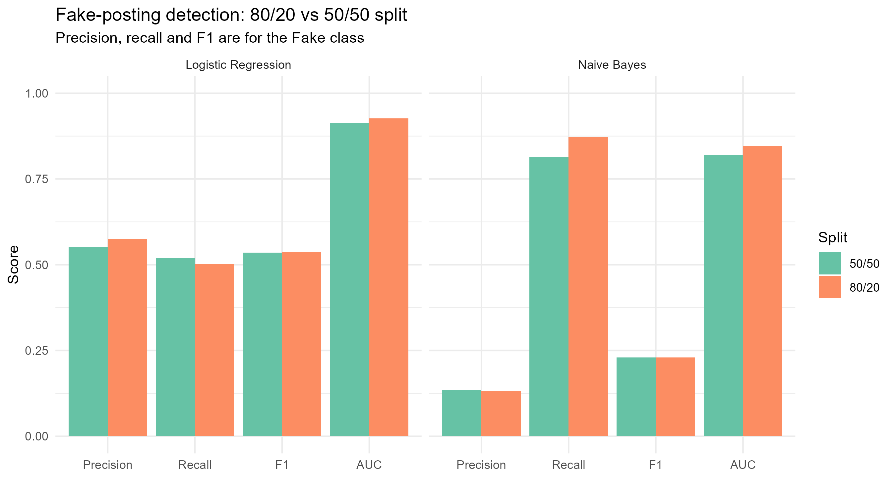

# Fake Job Posting Detection

A text-classification project in R that flags fraudulent job postings, comparing Naive Bayes and Logistic Regression on bag-of-words features.

## Problem

Fake job postings are used to steal personal information and money from job seekers. This project asks how well a model can flag them from the posting text alone.

## Data

[Real / Fake Job Posting Prediction](https://www.kaggle.com/datasets/shivamb/real-or-fake-fake-jobposting-prediction) (Kaggle): 17,880 job postings, of which **866 (4.8%) are fake**. The dataset is not included in this repo. Download `fake_job_postings.csv` and place it in `data/`.

## Approach

1. **Text preparation:** combine the title, company profile, description, requirements, and benefits into one text field per posting. Lowercase, strip punctuation and numbers, remove English stopwords, stem, and normalize whitespace (`tm`, `SnowballC`).
2. **Features:** build a document-term matrix and drop terms that appear in very few documents (`removeSparseTerms`, 0.90).
3. **Models:** Naive Bayes (`e1071`) and Logistic Regression (`glm`, binomial).
4. **Evaluation:** two train/test splits (80/20 and 50/50, seed 530), plus 5-fold cross-validation scored by ROC-AUC (`caret`, `pROC`).

**Fake is the positive class.** Precision, recall, and F1 below measure how well each model detects fake postings.

## Results

| Split | Model | Precision | Recall | F1 | AUC | 5-fold CV AUC |
|---|---|---|---|---|---|---|
| 80/20 | Logistic Regression | 0.58 | 0.50 | 0.54 | 0.93 | 0.93 |
| 80/20 | Naive Bayes | 0.13 | 0.87 | 0.23 | 0.85 | 0.85 |
| 50/50 | Logistic Regression | 0.55 | 0.52 | 0.54 | 0.91 | 0.93 |
| 50/50 | Naive Bayes | 0.13 | 0.82 | 0.23 | 0.82 | 0.85 |




## Key Findings

- **Accuracy would be misleading here.** Because 95% of postings are real, a model that labels everything "real" is 95% accurate and catches no fraud. That is why the results above report precision, recall, and F1 on the fake class, and AUC.
- **Logistic Regression is the better-balanced model.** It reaches F1 of about 0.54 with precision around 0.55 to 0.58 and recall around 0.50 to 0.52. Its AUC is 0.91 to 0.93, and its cross-validated AUC is 0.93, against 0.85 for Naive Bayes.
- **Naive Bayes catches more fakes but raises many false alarms.** It finds 82% to 87% of fake postings, but only about 1 in 8 of the postings it flags is actually fake (precision 0.13). That is still better than the 4.8% base rate, but too noisy to be useful on its own.
- **Results are stable across splits.** Moving from 80/20 to 50/50 barely changes any metric, so the comparison does not depend on one particular split.

## Limitations

- Severe class imbalance: only 4.8% of postings are fake, and no resampling or class weighting was used.
- Text-only features: structured fields in the dataset (company logo, screening questions, employment type) were not used.
- Both models use the default 0.5 decision threshold. Lowering it for Logistic Regression would trade precision for recall.
- Logistic Regression is unregularized on a large number of correlated word features.

## Future Work

- Handle the imbalance with class weights or resampling (e.g. SMOTE)
- Tune the decision threshold to hit a target recall
- Try regularized logistic regression (`glmnet`) and tree-based models
- Add the structured metadata fields as features

## Running It

Install R packages (the script installs any that are missing): `caret`, `tm`, `SnowballC`, `e1071`, `naivebayes`, `pROC`, `ggplot2`, plus `reshape2` for the comparison chart.

1. Download `fake_job_postings.csv` into `data/`
2. Set your working directory to this folder (`setwd(...)`)
3. In `fake_job_detection.R`, set `TRAIN_FRACTION <- 0.8` and run `source("fake_job_detection.R")`
4. Change it to `0.5` and run it again
5. Optional: `source("compare_splits.R")` for a side-by-side chart

Each run writes its metrics, confusion matrices, and ROC curves to `results/`, with the split in the file name.

## Repository Structure

```
├── fake_job_detection.R    # Full pipeline: cleaning, features, models, evaluation
├── compare_splits.R        # Combines the two splits into one comparison chart
├── data/                   # Put fake_job_postings.csv here (not included)
└── results/                # Metrics CSVs, confusion matrices, ROC curves
```
